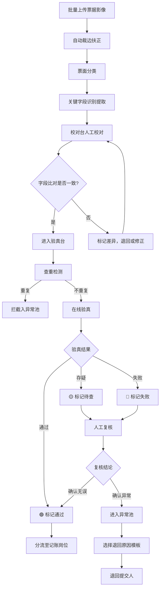

## 1. 产品概述

面向企业财务共享中心录单员的票据影像识别验真工作台，解决报销单、增值税发票、收据和行程票混合入池后的快速初审问题。核心流程为"先识别、再验真、后分流"，让录单员在一个界面内完成大部分初审动作，提升票据处理效率和合规性。

- 目标用户：企业财务共享中心录单员
- 核心价值：通过自动识别、智能验真、异常预警，将票据初审效率提升 60% 以上，降低重复报销和虚假票据风险

## 2. 核心功能

### 2.1 用户角色

| 角色 | 注册方式 | 核心权限 |
|------|----------|----------|
| 录单员 | 管理员分配账号 | 上传、识别、校对、验真、异常处理、导出 |
| 管理员 | 系统初始化 | 规则配置、统计查看、用户管理 |

### 2.2 功能模块

1. **上传台**：批量导入扫描件与拍照件、自动裁边扶正、票面分类（增值税发票/报销单/收据/行程票）
2. **识别校对台**：提取票号/金额/日期/税额等关键字段、识别购买方与销售方信息、自动比对报销单填报内容、人工校对编辑
3. **验真台**：查重拦截同票重复报销、验真状态分级显示（通过/存疑/失败）、连号票预警、同商户集中报销预警
4. **异常池**：版式异常与涂改痕迹提示、异常票据汇总管理、退回原因模板选择、人工复核留痕
5. **规则配置**：预警规则配置（连号阈值、同商户阈值等）、退回原因模板管理、验真策略参数调整
6. **统计页**：按部门或单据批次汇总通过率、处理效率统计、导出复核结果给后续记账岗位

### 2.3 页面详情

| 页面名称 | 模块名称 | 功能描述 |
|----------|----------|----------|
| 上传台 | 批量上传区 | 支持拖拽或点击上传扫描件/拍照件，支持 PDF/JPG/PNG/BMP，单次最多 50 张 |
| 上传台 | 预览与分类区 | 左侧缩略图列表，右侧大图预览，自动分类标签（增值税发票/报销单/收据/行程票），支持手动修正分类 |
| 上传台 | 处理状态栏 | 显示裁边扶正进度、分类进度，异常文件红色标记 |
| 识别校对台 | 票据列表 | 左侧票据缩略图+分类标签列表，支持按类型/状态筛选 |
| 识别校对台 | 字段提取区 | 右侧展示提取的关键字段（票号、金额、日期、税额、购买方、销售方），可逐字段编辑校对 |
| 识别校对台 | 比对结果区 | 下方展示识别内容与报销单填报内容的自动比对，差异字段高亮 |
| 识别校对台 | 批量操作栏 | 批量确认通过、批量退回、标记待复核 |
| 验真台 | 查重结果区 | 票据查重结果列表，重复票据红标并拦截，显示重复来源 |
| 验真台 | 验真状态面板 | 每张票据验真状态分级显示：🟢验证通过 / 🟡存疑待查 / 🔴验证失败 |
| 验真台 | 预警提示区 | 连号票预警标签、同商户集中报销预警标签，关联规则说明 |
| 验真台 | 操作区 | 单票/批量验真、强制通过、退回异常池 |
| 异常池 | 异常票据列表 | 版式异常、涂改痕迹、验真失败、查重拦截的票据汇总 |
| 异常池 | 退回操作区 | 选择退回原因模板、补充说明、退回至提交人 |
| 异常池 | 复核留痕 | 每次操作记录操作人、时间、动作、备注 |
| 规则配置 | 预警规则 | 连号票检测阈值、同商户集中报销阈值、金额异常阈值配置 |
| 规则配置 | 退回原因模板 | 新增/编辑/删除退回原因模板，支持分级分类 |
| 规则配置 | 验真策略 | 验真超时时间、自动验真开关、失败重试次数 |
| 统计页 | 通过率统计 | 按部门/批次/票种汇总通过率、失败率、待处理率 |
| 统计页 | 处理效率 | 平均处理时长、日处理量趋势、异常率趋势 |
| 统计页 | 导出功能 | 导出复核结果 Excel，供后续记账岗位使用 |

## 3. 核心流程

票据影像从上传到分流完成的完整初审流程：

## 4. 用户界面设计

### 4.1 设计风格

- **整体风格**：工业务实风，偏深色调，高信息密度，类似企业级管控台风格
- **主色**：深海蓝 `#1B2A4A`，强调效率与专业
- **辅色**：中性灰 `#64748B`，用于背景和边框
- **强调色**：翠绿 `#10B981`（通过）、琥珀 `#F59E0B`（存疑）、玫红 `#EF4444`（失败/异常）
- **按钮风格**：圆角 6px，扁平化，主操作按钮带微阴影
- **字体**：正文 14px 思源黑体/Noto Sans SC，标题 16-20px 加粗，数据 13px 等宽字体
- **布局风格**：左侧固定侧边栏导航 + 顶部标签页 + 主内容区三栏/双栏自适应布局
- **图标风格**：线性图标，2px 描边，Lucide 图标库

### 4.2 页面设计概览

| 页面名称 | 模块名称 | UI 元素 |
|----------|----------|---------|
| 上传台 | 批量上传区 | 虚线拖拽区域，文件类型图标，进度条，状态徽章 |
| 上传台 | 预览与分类区 | 左侧缩略图网格（4列），右侧大图+分类标签下拉，裁边前后对比切换 |
| 识别校对台 | 票据列表 | 左侧紧凑列表，分类色标条，状态图标 |
| 识别校对台 | 字段提取区 | 表单布局，字段标签+可编辑输入框，置信度百分比条 |
| 识别校对台 | 比对结果区 | 双列对比表格，差异字段红色背景高亮 |
| 验真台 | 查重结果区 | 表格列表，重复票据行红色左边框，来源链接 |
| 验真台 | 验真状态面板 | 状态徽章（绿/黄/红），时间线式验真记录 |
| 验真台 | 预警提示区 | 黄色/橙色预警卡片，规则说明链接 |
| 异常池 | 异常票据列表 | 可筛选表格，异常类型图标，严重程度标签 |
| 异常池 | 退回操作区 | 模板选择下拉+富文本补充，操作确认弹窗 |
| 异常池 | 复核留痕 | 时间线组件，操作人头像+动作标签+备注 |
| 规则配置 | 预警规则 | 配置表单，数值输入+单位标签，开关切换 |
| 规则配置 | 退回原因模板 | 卡片式列表，新增/编辑弹窗 |
| 统计页 | 通过率统计 | 堆叠柱状图+数据表格，部门/批次切换标签 |
| 统计页 | 处理效率 | 折线趋势图，关键指标卡片 |
| 统计页 | 导出功能 | 导出按钮+格式选择下拉，导出进度提示 |

### 4.3 响应式设计

- 桌面优先设计，最低支持 1280px 宽度
- 侧边栏可折叠至图标模式
- 主内容区最小宽度 960px，超出部分自适应
- 列表与详情区可拖拽调整宽度比例

### 4.4 3D 场景

不适用
