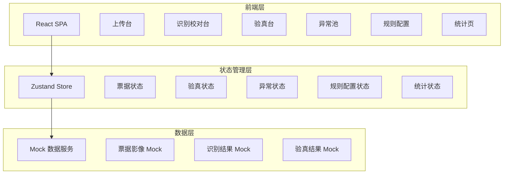
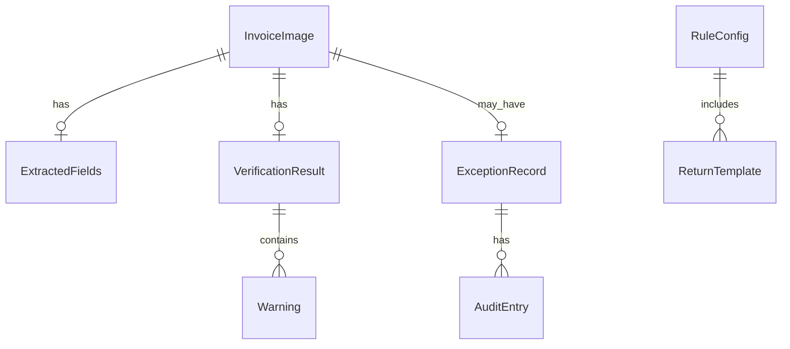

## 1. 架构设计



## 2. 技术说明

- **前端**：React 18 + TypeScript + TailwindCSS 3 + Vite
- **初始化工具**：vite-init (react-ts 模板)
- **后端**：无（纯前端项目，使用 Mock 数据模拟识别与验真流程）
- **状态管理**：Zustand
- **路由**：react-router-dom v6
- **图表**：recharts
- **图标**：lucide-react
- **数据**：Mock 数据模拟票据影像、识别结果、验真结果

## 3. 路由定义

| 路由 | 用途 |
|------|------|
| `/upload` | 上传台：批量导入、预览、分类 |
| `/recognize` | 识别校对台：字段提取、校对、比对 |
| `/verify` | 验真台：查重、验真状态、预警 |
| `/exceptions` | 异常池：异常票据管理、退回、留痕 |
| `/rules` | 规则配置：预警规则、退回模板、验真策略 |
| `/statistics` | 统计页：通过率、处理效率、导出 |

## 4. API 定义

本项目为纯前端，使用 Mock 数据服务，定义以下数据接口：

### 4.1 票据数据结构

```typescript
interface InvoiceImage {
  id: string
  fileName: string
  fileUrl: string
  fileType: 'pdf' | 'jpg' | 'png' | 'bmp'
  uploadTime: string
  status: 'pending' | 'processing' | 'classified' | 'error'
  category: 'vat_invoice' | 'reimbursement' | 'receipt' | 'travel_ticket' | 'unknown'
  croppedUrl?: string
}

interface ExtractedFields {
  invoiceNumber: string
  amount: number
  taxAmount: number
  totalAmount: number
  date: string
  buyerName: string
  buyerTaxId: string
  sellerName: string
  sellerTaxId: string
  confidence: number
}

interface VerificationResult {
  invoiceId: string
  duplicateCheck: { isDuplicate: boolean; duplicateSource?: string }
  onlineVerify: 'passed' | 'suspected' | 'failed' | 'pending'
  warnings: Warning[]
  verifyTime: string
}

interface Warning {
  type: 'consecutive' | 'same_merchant' | 'amount_anomaly' | 'format_anomaly' | 'tampering'
  message: string
  severity: 'low' | 'medium' | 'high'
}

interface ExceptionRecord {
  invoiceId: string
  exceptionType: string
  reason: string
  returnTemplate?: string
  operator: string
  operateTime: string
  auditTrail: AuditEntry[]
}

interface AuditEntry {
  operator: string
  action: string
  timestamp: string
  remark: string
}

interface RuleConfig {
  consecutiveThreshold: number
  sameMerchantThreshold: number
  amountAnomalyThreshold: number
  verifyTimeout: number
  autoVerify: boolean
  maxRetryCount: number
}

interface ReturnTemplate {
  id: string
  name: string
  category: string
  content: string
}

interface StatisticsData {
  department: string
  total: number
  passed: number
  failed: number
  pending: number
  passRate: number
}
```

## 5. 服务器架构图

不适用（纯前端项目）

## 6. 数据模型

### 6.1 数据模型定义



### 6.2 数据定义语言

不适用（纯前端 Mock 数据，无数据库）
